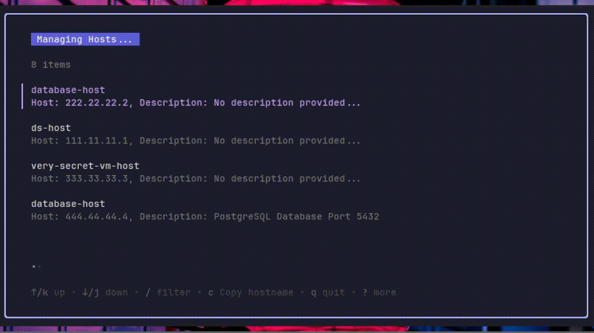
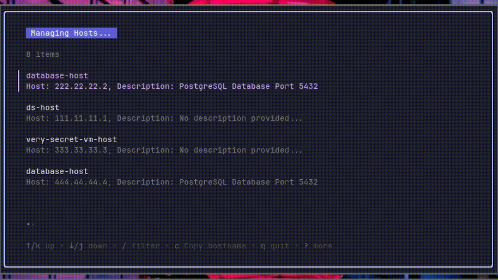

<!-- PROJECT SHIELDS -->
[![Continuous Integration][cd-shield]][cd-url]
[![Relase][release-shield]][release-url]


<!-- PROJECT LOGO -->
<br />
<p align="center">
  <a href="https://github.com/giovalgas/hosts-tui">
    
  </a>

<h3 align="center">Hosts TUI</h3>

  <p align="center">
    Simple terminal UI for managing /etc/hosts files!
    <br />
    <br />
    <a href="https://github.com/giovalgas/giovalgas/hosts-tui/issues">Report Bugs</a>
    ·
    <a href="https://github.com/giovalgas/giovalgas/hosts-tui/issues">Request Features</a>
  </p>
</p>

<!-- TABLE OF CONTENTS -->
## Table of Contents

* [About the Project](#about-the-project)
* [Getting started](#getting-started)
  * [Installation](#installation)
    * [Linux](#linux)
    * [Manually](#manually)
    * [Windows](#windows)
    * [MacOS](#macos)
* [Contact](#contact)
* [Contributing](#contributing)
## About the Project
<table>
  <tr>
    <td></td>
    <td></td>
  </tr>
 </table>

Simple terminal UI for managing /etc/hosts files!

### Built with:
This project was built with:
- [Go](https://go.dev/)
- [Bubbles](https://github.com/charmbracelet/bubbles)
- [Bubbletea](https://github.com/charmbracelet/bubbletea)
- [Lipgloss](https://github.com/charmbracelet/lipgloss)

### Support the dev

Enjoyed the app and want to support me monetarily? [buy me a coffe!](https://www.buymeacoffee.com/giovalgasdev)
Any donations are going to be **greatly appreciated!**

## Getting Started

For copying hostnames you'll need [xclip]() or [xsel](https://github.com/kfish/xsel)

### Installation

#### Linux
```bash
PROJ_VERSION=$(curl -s "https://api.github.com/repos/giovalgas/hosts-tui/releases/latest" | grep -Po '"tag_name": "v\K[^"]*')
curl -Lo hosts-tui.tar.gz "https://github.com/giovalgas/hosts-tui/releases/download/v"$PROJ_VERSION"/hosts-tui_Linux_x86_64.tar.gz"
tar xf hosts-tui.tar.gz hosts-tui
sudo install hosts-tui /usr/local/bin
```
#### Manually
You will need to [install Go](https://go.dev/doc/install)

```bash
git clone https://github.com/giovalgas/hosts-tui.git
cd hosts-tui
go install
```

#### MacOS
[Install manually](#manually)

#### Windows
Currently not supported :(

## Contributing

Contributions are what make the open source community such an amazing place to be learn, inspire, and create. Any contributions you make are **greatly appreciated**.

1. Fork the Project
2. Create your Feature Branch (`git checkout -b feature/AmazingFeature`)
3. Commit your Changes (`git commit -m 'Add some AmazingFeature'`)
4. Push to the Branch (`git push origin feature/AmazingFeature`)
5. Open a Pull Request

## Contact
Giovani Valgas - [/in/giovalgas](https://www.linkedin.com/in/giovalgas/) - giovalgascom@gmail.com


<!-- MARKDOWN LINKS & IMAGES -->
<!-- https://www.markdownguide.org/basic-syntax/#reference-style-links -->
[cd-shield]: https://github.com/giovalgas/hosts-tui/actions/workflows/continuous-deployment.yaml/badge.svg
[cd-url]: https://github.com/giovalgas/hosts-tui/actions/workflows/continuous-deployment.yaml
[release-shield]: https://img.shields.io/github/v/release/giovalgas/hosts-tui
[release-url]: https://github.com/giovalgas/hosts-tui/releases/